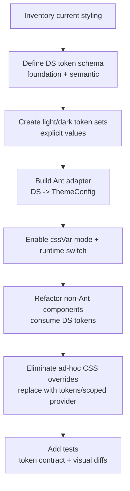

# Customizing a Token-Driven Design System with Ant Design v5 and Non-Ant Components

## Executive summary

A clean, scalable way to customize **Ant Design v5** while integrating non-Ant components is to treat *your own design tokens as the single source of truth*, then generate **Ant’s `ThemeConfig`** from that source for each theme (light/dark), rather than relying on Ant’s seed-color → derived palette generation alone. Ant’s v5 token model is explicitly layered (Seed → Map → Alias), and Ant’s own docs position seed tokens as sufficient for many cases—but also describe how to override Map/Alias tokens and/or provide custom algorithms when you need tighter control. citeturn23view4turn23view0  

For **runtime theme switching**, enabling **CSS Variable mode** (`theme.cssVar`) is typically the best foundation: Ant’s docs say it (a) allows style sharing across themes (smaller CSS footprint) and (b) avoids re-serializing styles on theme switch (faster switching). They also describe the need for a unique key (or React 18’s auto `useId`) and note that disabling hashing can further reduce total style size when only one antd version is present. citeturn13search2turn21search7  

To keep overrides non-messy, prefer token overrides (`theme.token` + `theme.components`) and scoped extension points (e.g., `ConfigProvider` per-component `className/style` config introduced in v5.7.0) instead of global `.ant-*` overrides. Ant’s own “Extends Theme” article frames this as a maintainability / style-conflict problem in multi-person codebases and shows how `ConfigProvider` can isolate style changes. citeturn15view2turn23view0  

---

## Assumptions

This report makes the following explicit assumptions (because you left them unspecified):

- Target UI stack is **React** (with Ant Design v5). citeturn23view0  
- You need **light + dark** themes and **runtime switching** via React state (no page reload). Ant v5 documents dynamic switching through `ConfigProvider`’s `theme` prop. citeturn23view3  
- Build tooling is flexible (e.g., Vite/Webpack/Next.js), and CSS strategy is flexible (CSS Modules, vanilla CSS, Tailwind, CSS-in-JS, etc.). Ant v5 has explicit guidance around CSS specificity and compatibility controls (`:where`, `@layer`, `StyleProvider`) that matter regardless of bundler. citeturn8view0turn4view0  
- SSR is *optional*. Where relevant, this report includes SSR-ready patterns (notably `@ant-design/cssinjs` cache extraction and static style extraction). citeturn4view0turn11view0  

---

## Ant Design v5 theming primitives that matter for a mixed component ecosystem

Ant Design v5 moved theming to a Design Token model applied through `ConfigProvider`. Ant’s v5 docs describe theme customization as:
- setting **global tokens** via `theme.token`,
- selecting or composing **algorithms** via `theme.algorithm`,
- overriding **component tokens** via `theme.components`,
- switching themes dynamically and nesting local themes via nested `ConfigProvider`. citeturn23view3turn23view0  

### Token layering and what it implies for “fine-grained palette control”

Ant v5’s docs describe a **three-layer derivation**:
- **Seed Token**: the “origin” tokens (e.g., `colorPrimary`) that can drive algorithmic derivation,
- **Map Token**: gradient/derived tokens created from seeds (recommended to customize via `theme.algorithm` to preserve gradients),
- **Alias Token**: higher-level aliases or special handling of map tokens (e.g., link colors, shared component semantics). citeturn23view4turn23view0  

This is the core reason “seed-only theming” often becomes insufficient for strict design systems: seed tokens are designed to *generate* consistent derivatives. If you already have a bespoke palette (brand ramps, neutrals, semantic colors with WCAG intent), you typically want to **map your existing tokens onto Ant’s alias/map tokens explicitly**, rather than letting algorithms generate hover/active/background variants that may not match your palette strategy. citeturn23view4turn3view3turn3view4  

### Component tokens and per-component overrides

Ant v5 allows component-specific customization with `theme.components`, and the v5 docs highlight an important nuance:

- Component tokens **override** global tokens, but (by default) **do not derive** from Seed Tokens.
- Starting **v5.8.0**, component tokens can opt into derivation via a component-level `algorithm` property. citeturn23view3turn23view4  

This matters when you want a clean “variant system” for a subset of components (e.g., special button variants) without global overrides: you can scope overrides to a subtree or a component config, and decide whether to keep algorithmic derivation on or off. citeturn23view0turn23view3  

### Runtime switching and CSS Variables mode

Ant’s **CSS Variables mode** (`theme.cssVar`) is explicitly positioned as beneficial for applications that “depend on theme capabilities,” with two concrete improvements:
1) styles for the same component under different themes can be shared (reducing total style size),
2) theme switches avoid re-serializing styles (improving switching performance). citeturn13search2turn21search7  

Ant’s v5 CSS Variables docs also caution that the mode requires a **unique key** for style isolation; React 18 uses `useId` automatically, while React 16/17 requires manually providing keys. They also note that after CSS variables are enabled, disabling hashing (`hashed: false`) can reduce style size when only one antd version is present. citeturn21search7  

### “Static methods” and theme context

Ant v5 warns that `ConfigProvider` does **not** affect static calls like `message.xxx`, `Modal.xxx`, and `notification.xxx`, because those APIs create a separate React tree (via `ReactDOM.render`), thus losing the surrounding context. The docs recommend using hook-based APIs (e.g., `Modal.useModal`) or the `App` component approach that provides context-aware instances. citeturn23view0turn10view0  

This is easy to miss and becomes painful in theme-switching apps: if your design system expects consistent theming everywhere, you must route feedback UIs (message/notification/modal) through context-aware instances. citeturn23view0turn10view0  

---

## Strategy comparison and recommendations

Below are three common theming strategies that match your requested comparison axes.

### Pros/cons table for key approaches

| Approach | What you do | Strengths | Weaknesses / risks | Best fit |
|---|---|---|---|---|
| Seed color–driven (minimal mapping) | Set a small set of Seed Tokens like `colorPrimary` and rely on algorithms (default/dark) to derive most Map/Alias tokens | Fast to start; leverages Ant’s intended derivation model; fewer tokens to manage citeturn23view4turn23view0 | Conflicts with “custom palette fidelity” (hover/active/semantic ramps may differ from your brand system); hard to ensure non-Ant components match Ant-derived ramps; encourages ad-hoc fixes later citeturn23view4turn23view0 | Apps that accept Ant’s color semantics; early prototypes |
| Full token mapping (design system as source-of-truth) | Maintain your own token dictionary (light/dark) and map it to Ant’s `theme.token` (and selectively `theme.components`) | Best for fine-grained control and cross-library consistency; enables “token contract” for both Ant + non-Ant; avoids messy CSS overrides by staying within token APIs citeturn23view4turn23view0turn15view2 | More upfront work (token design + mapping); must track Ant token surface changes; can’t “extend `theme.useToken()`” with custom tokens (you need your own hook/provider) citeturn17view0turn23view0 | Mature design systems, multi-team environments, strict brand requirements |
| CSS Variables–first bridging | Enable Ant CSS variables (`cssVar`) and drive both Ant + non-Ant components via CSS variables (possibly with your own `--ds-*` variables) | Strong runtime switching performance and shared styles; good for hybrid styling stacks (CSS Modules / Tailwind / vanilla CSS) citeturn13search2turn21search7turn8view0 | Pitfall: Seed tokens may not behave as expected when set to `var(...)` (because algorithms expect concrete values for derivation); requires careful design to avoid “var-driven derivation” gaps citeturn22view1turn23view4 | Large apps with frequent theme switching and mixed styling approaches |

**Recommendation for your constraints:** Combine **Full token mapping** + **CSS Variables mode**, using your design system tokens as the canonical source, and generating:
- Ant `ThemeConfig` (token + component overrides),
- your own CSS variables (for non-Ant components),
- and a shared `useDesignTokens()` hook (for JS/TS consumption).  

This directly satisfies:
- fine-grained palette control (you own the palette),
- token-driven styling for Ant and non-Ant,
- minimal messy overrides (token/component config > global CSS hacks),
- runtime switching with good performance via CSS variable mode. citeturn13search2turn23view0turn15view2  

---

## Reference architecture, mapping model, and code patterns

### Architecture overview

```mermaid
flowchart LR
  A[Source-of-truth tokens<br/>Design system JSON/TS<br/>Light + Dark] --> B[Token compiler / normalizer<br/>validate + flatten + semantic roles]
  B --> C[Ant Theme Adapter<br/>map DS tokens -> ThemeConfig.token + ThemeConfig.components]
  B --> D[Non-Ant Adapter<br/>emit CSS vars (--ds-*) + TS hook]
  C --> E[ConfigProvider theme={...}<br/>cssVar on + hashed policy]
  E --> F[Ant components]
  D --> G[Custom components<br/>CSS Modules / Tailwind / CSS-in-JS]
  B --> H[Test artifacts<br/>snapshots + contrast checks + regression baselines]
```

This structure formalizes a “token contract”: **no UI component (Ant or custom) is allowed to hardcode colors/spacing**; everything must flow from the token source-of-truth, and Ant is simply another consumer via the adapter. The need for a separate custom-token system (instead of trying to inject new tokens into Ant’s token type) matches real-world pain raised by teams that want extra background/surface tokens without affecting antd components. citeturn17view0turn23view4  

### Base token design: what to store vs what to derive

A practical split that aligns with Ant’s Seed/Map/Alias model is:

- **Foundation tokens**: raw ramps/scales (brand 50–900, neutral 0–1000), typography scale, radius scale, spacing scale.
- **Semantic tokens**: “role” tokens used by components (`bg.canvas`, `bg.surface`, `text.primary`, `border.default`, `focus.ring`, etc.).
- **Component semantic tokens** (optional): stable component-level defaults for custom components (not Ant components), e.g. `card.padding`, `sidebar.bg`.  

This is consistent with Ant’s own explanation that seed tokens are the origin, map tokens are gradients, and alias tokens express reusable semantics. citeturn23view4turn23view0  

### TypeScript/React pattern: token source + adapters

#### Token schema (example)

```ts
// designTokens.ts
export type ThemeMode = 'light' | 'dark';

export type DsColorTokens = {
  brand: {
    primary: string;
    primaryHover: string;
    primaryActive: string;
  };
  bg: {
    canvas: string;
    surface: string;
    elevated: string;
    mask: string;
  };
  text: {
    primary: string;
    secondary: string;
    tertiary: string;
    disabled: string;
    inverse: string; // on dark/brand surfaces
  };
  border: {
    default: string;
    secondary: string;
  };
  state: {
    success: string;
    warning: string;
    error: string;
    info: string;
    focusRing: string;
  };
};

export type DsShapeTokens = {
  radius: {
    xs: number;
    sm: number;
    md: number;
    lg: number;
  };
};

export type DsTypographyTokens = {
  fontFamily: string;
  fontSizeBase: number;
  lineHeightBase: number;
};

export type DsTheme = {
  mode: ThemeMode;
  color: DsColorTokens;
  shape: DsShapeTokens;
  typography: DsTypographyTokens;
};

// Example: keep values explicit (no automatic generation here).
export const lightTheme: DsTheme = {
  mode: 'light',
  color: {
    brand: {
      primary: '#2457FF',
      primaryHover: '#1D46DB',
      primaryActive: '#1737B0',
    },
    bg: {
      canvas: '#F6F7FB',
      surface: '#FFFFFF',
      elevated: '#FFFFFF',
      mask: 'rgba(0, 0, 0, 0.45)',
    },
    text: {
      primary: 'rgba(0,0,0,0.88)',
      secondary: 'rgba(0,0,0,0.65)',
      tertiary: 'rgba(0,0,0,0.45)',
      disabled: 'rgba(0,0,0,0.25)',
      inverse: '#FFFFFF',
    },
    border: {
      default: '#D9D9D9',
      secondary: '#F0F0F0',
    },
    state: {
      success: '#52C41A',
      warning: '#FAAD14',
      error: '#FF4D4F',
      info: '#1677FF',
      focusRing: 'rgba(36,87,255,0.20)',
    },
  },
  shape: { radius: { xs: 2, sm: 4, md: 6, lg: 8 } },
  typography: { fontFamily: 'system-ui, -apple-system, Segoe UI, Roboto, Arial', fontSizeBase: 14, lineHeightBase: 1.57 },
};

// darkTheme would explicitly define dark semantic values (not shown for brevity).
```

This “explicit semantic token per theme” approach directly avoids “seed-only” dependency and mirrors real-world needs described by teams that wanted more background tokens for custom components without changing antd’s own background tokens. citeturn17view0turn23view4  

#### Mapping strategy: DS tokens → Ant `ThemeConfig`

Ant v5 exposes `theme.token` (typed as `AliasToken`) plus `algorithm`, `components`, `cssVar`, `hashed`, and `inherit`. citeturn23view4turn23view0  

Key idea: map your semantic tokens to Ant’s **Alias/Map tokens** as much as possible (e.g., `colorBgContainer`, `colorTextSecondary`) instead of mapping only to seeds (e.g., `colorPrimary`) and letting derivations happen. Ant explicitly documents both override paths: via `theme.token` and via algorithms. citeturn23view4turn23view0  

```ts
// antThemeAdapter.ts
import type { ThemeConfig } from 'antd';
import { theme as antdTheme } from 'antd';
import type { DsTheme } from './designTokens';

const { defaultAlgorithm, darkAlgorithm } = antdTheme;

export function mapDsToAntTheme(ds: DsTheme): ThemeConfig {
  const isDark = ds.mode === 'dark';

  return {
    algorithm: isDark ? darkAlgorithm : defaultAlgorithm,
    cssVar: { key: `ds-${ds.mode}` }, // see notes below
    hashed: false, // safe when only one antd version is in the app
    token: {
      // Brand semantics
      colorPrimary: ds.color.brand.primary,
      colorPrimaryHover: ds.color.brand.primaryHover,
      colorPrimaryActive: ds.color.brand.primaryActive,

      // Background / surfaces
      colorBgLayout: ds.color.bg.canvas,
      colorBgContainer: ds.color.bg.surface,
      colorBgElevated: ds.color.bg.elevated,
      colorBgMask: ds.color.bg.mask,

      // Text
      colorText: ds.color.text.primary,
      colorTextSecondary: ds.color.text.secondary,
      colorTextTertiary: ds.color.text.tertiary,
      colorTextDisabled: ds.color.text.disabled,

      // Borders / splits
      colorBorder: ds.color.border.default,
      colorBorderSecondary: ds.color.border.secondary,

      // Status
      colorSuccess: ds.color.state.success,
      colorWarning: ds.color.state.warning,
      colorError: ds.color.state.error,
      colorInfo: ds.color.state.info,

      // Typography / shape
      fontFamily: ds.typography.fontFamily,
      fontSize: ds.typography.fontSizeBase,
      lineHeight: ds.typography.lineHeightBase,
      borderRadius: ds.shape.radius.md,
    },
    components: {
      // Optional example: scope a tweak without touching global tokens
      // Button: { borderRadius: ds.shape.radius.md },
    },
  };
}
```

Why `cssVar.key` and why `hashed: false`?
- Ant’s CSS variable docs explain key-based isolation (auto in React 18; manual in older React), and document that hashed can be disabled when CSS variables are enabled and only one antd version is present (reducing style size). citeturn21search7turn13search2  
- If you expect multiple antd versions (micro-frontends), keep hashing on; Ant’s own community explains hash scoping as style isolation for multi-instance scenarios. citeturn6search8turn21search7  

#### Runtime switching: `ConfigProvider` + your own Design System provider

Ant’s v5 docs state you can dynamically switch themes at any time through `ConfigProvider`’s `theme` prop “without any additional configuration.” citeturn23view3  

```tsx
// ThemeRoot.tsx
import React from 'react';
import { ConfigProvider, App as AntApp } from 'antd';
import type { DsTheme, ThemeMode } from './designTokens';
import { lightTheme /*, darkTheme */ } from './designTokens';
import { mapDsToAntTheme } from './antThemeAdapter';

const DesignTokensContext = React.createContext<DsTheme | null>(null);

export function useDesignTokens(): DsTheme {
  const ctx = React.useContext(DesignTokensContext);
  if (!ctx) throw new Error('useDesignTokens must be used under ThemeRoot');
  return ctx;
}

export const ThemeRoot: React.FC<React.PropsWithChildren> = ({ children }) => {
  const [mode, setMode] = React.useState<ThemeMode>('light');

  const dsTheme = React.useMemo<DsTheme>(() => {
    return mode === 'light' ? lightTheme : lightTheme /* replace with darkTheme */;
  }, [mode]);

  const antTheme = React.useMemo(() => mapDsToAntTheme(dsTheme), [dsTheme]);

  return (
    <DesignTokensContext.Provider value={dsTheme}>
      <ConfigProvider theme={antTheme}>
        {/* App pairs with ConfigProvider for context-aware message/modal/notification */}
        <AntApp>
          {children}
        </AntApp>

        {/* For demo only: wire setMode somewhere in your UI */}
      </ConfigProvider>
    </DesignTokensContext.Provider>
  );
};
```

The `App` pairing is important because Ant v5 documents that static `message/modal/notification` calls don’t receive `ConfigProvider` context; the `App` component provides context-aware instances (and is available since antd 5.1.0). citeturn23view0turn10view0  

### Mapping table: custom DS tokens → Ant tokens

The following table shows a pragmatic mapping layer from a semantic design system into Ant’s token names. The Ant token names referenced are drawn from Ant’s global token lists (Seed/Map/Alias) and examples in v5 theming docs. citeturn23view4turn3view3turn3view4  

| Design system token (example) | Ant token | Ant layer (typical) | Notes |
|---|---|---|---|
| `ds.color.brand.primary` | `colorPrimary` | Seed | Brand color; Ant docs describe this as a seed that can generate a palette; you’re overriding explicitly. citeturn23view4 |
| `ds.color.brand.primaryHover` | `colorPrimaryHover` | Map | Map tokens are gradients/derived; overriding gives palette fidelity. citeturn23view4turn3view3 |
| `ds.color.brand.primaryActive` | `colorPrimaryActive` | Map | Same rationale as hover. citeturn3view3turn23view4 |
| `ds.color.state.success` | `colorSuccess` | Seed/Map usage | Used broadly across feedback components. citeturn3view3 |
| `ds.color.state.warning` | `colorWarning` | Seed/Map usage | Warning semantic. citeturn3view3 |
| `ds.color.state.error` | `colorError` | Seed/Map usage | Error semantic. citeturn3view3 |
| `ds.color.state.info` | `colorInfo` | Seed | Ant FAQ notes `colorInfo` is independent from `colorPrimary` (both seeds). citeturn12view0 |
| `ds.color.bg.canvas` | `colorBgLayout` | Map | Ant describes this as layout background (B1) usage. citeturn3view3 |
| `ds.color.bg.surface` | `colorBgContainer` | Map | Default container backgrounds (inputs, default buttons, etc.). citeturn3view3 |
| `ds.color.bg.elevated` | `colorBgElevated` | Map | Popup-layer containers; docs mention dark mode handling. citeturn3view3 |
| `ds.color.bg.mask` | `colorBgMask` | Map | Mask overlays (modal, drawer, etc.). citeturn3view3 |
| `ds.color.text.primary` | `colorText` | Map | Default neutral text. citeturn3view4 |
| `ds.color.text.secondary` | `colorTextSecondary` | Map | Secondary text. citeturn3view4 |
| `ds.color.text.tertiary` | `colorTextTertiary` | Map | Tertiary text. citeturn3view4 |
| `ds.color.text.disabled` | `colorTextDisabled` | Map | Disabled text. citeturn3view4 |
| `ds.color.border.default` | `colorBorder` | Map | Base borders. citeturn3view3turn3view4 |
| `ds.color.border.secondary` | `colorBorderSecondary` | Map | Light separators; docs note relation to `colorSplit`. citeturn3view3 |
| `ds.typography.fontFamily` | `fontFamily` | Seed | Base font family token exists as a seed token. citeturn3view2turn23view4 |
| `ds.typography.fontSizeBase` | `fontSize` | Seed | Default font size. citeturn3view2turn23view4 |
| `ds.shape.radius.md` | `borderRadius` | Seed | Base radius seed; map tokens derive other radii. citeturn3view3turn23view4 |
| `ds.shadow.level1` | `boxShadow` | Alias | Alias tokens include `boxShadow` values. citeturn3view4 |

**Important modeling note:** this table intentionally **does not** force your design system to reuse Ant’s tokens as your own semantic surface model. The GitHub issue on “custom background tokens” shows the exact failure mode of equating “Ant global background tokens” with “all custom surfaces”: changing Ant’s background tokens changes Ant components too. A separate DS background/surface model avoids that coupling. citeturn17view0turn3view3  

### Safe extension points beyond tokens

Even with a comprehensive token map, there will be cases tokens don’t express well (e.g., fancy gradients, masks, bespoke outlines). Ant’s “Extends Theme” blog argues that forcing those into tokens can deteriorate code quality and advocates using `ConfigProvider` as a scoped extension point. It also states that since v5.7.0, `ConfigProvider` supports per-component `className/style` configuration, and explains why that is safer than globally overriding `.ant-*` selectors in a large team (style conflicts). citeturn15view2  

If you use this route, you must also handle `prefixCls` correctly because `prefixCls` can change (e.g., micro-frontend / coexistence / custom prefix). The blog shows consuming `getPrefixCls` and mixing it into your selector generation. citeturn15view2turn18view0  

---

## Pitfalls, guardrails, and “don’t step on rakes” notes

### Theme-specific overrides must be delivered as theme-specific configs

A recurring real-world confusion is expecting one override object to “apply differently” under different algorithms (light vs dark). A 2025 issue describes `token: { colorBgBase: "#141414" }` intended for dark mode also making light unusable, and notes lack of an “override per algorithm” mechanism. Practically, you avoid this by producing **two complete theme configs** (light + dark) from your DS tokens and switching at runtime. citeturn20view0turn23view3  

### Don’t try to “extend Ant tokens” to power your own system

Ant’s token typing and `theme.useToken()` are designed around Ant’s token surfaces. A long-standing request is to allow custom variables inside `ThemeConfig.token` so custom backgrounds could be accessed via `theme.useToken()`; the issue was closed “not planned.” That’s a strong signal that you should provide **your own token context/hook** for non-Ant tokens, and only map into Ant for Ant consumption. citeturn17view0turn23view0  

### Beware CSS variables inside Seed Tokens (algorithmic derivation needs concrete values)

If you try to set Seed Tokens to CSS variables (`colorPrimary: "var(--ds-primary)"`) you can run into derivation gaps: an open issue reports that setting CSS variables for seed tokens didn’t correctly update the component visuals (while some component token usage did), in antd 5.17.3. This aligns with Ant’s own explanation that algorithms expand seed tokens into derived map tokens; algorithms generally require concrete color values to compute gradients. citeturn22view1turn23view4  

**Guardrail:** if you want CSS-variable-driven theming, prefer:
- using Ant’s **CSS variable mode** (so Ant itself emits variables from actual token values), and/or
- overriding **derived** tokens directly (Map/Alias), rather than expecting algorithms to derive from `var()`. citeturn13search2turn23view4turn22view1  

### Style override hygiene: specificity, `:where`, and `@layer`

Ant’s CSS compatibility docs state:
- Ant uses `:where(...)` selectors by default to lower specificity (reducing upgrade friction),
- `StyleProvider hashPriority="high"` removes the `:where` wrapper if needed (legacy compatibility, priority control),
- `@layer` support (>=5.17.0) can place antd styles in a layer to intentionally keep them lower-priority than application CSS (but requires browser compatibility awareness). citeturn8view0turn4view0  

This is directly relevant to “avoid messy overrides.” You can deliberately choose:
- token-first customization for 90% of cases,
- `ConfigProvider` scoped overrides for exceptions,
- and use `@layer` / hash priority tools when integrating multiple styling systems. citeturn15view2turn8view0  

### Static calls: “why isn’t my toast themed?”

Ant v5 explicitly warns that static methods like `message.xxx`, `Modal.xxx`, `notification.xxx` won’t consume `ConfigProvider` context, and points you to hook-based approaches or `App`. citeturn23view0turn10view0  

In a design-system context, treat this as a **non-negotiable migration step**: route all feedback UI through `App.useApp()` or hook instances so that theme switching remains consistent. citeturn10view0turn23view0  

---

## Testing strategy and runtime performance considerations

### Token-contract testing with `getDesignToken`

Ant v5 provides a **static token consumer** `theme.getDesignToken(config)` that accepts the same config object shape as `ConfigProvider theme`. This is valuable for:
- snapshotting the generated Ant token set per DS theme,
- verifying that critical tokens are present and stable across refactors,
- catching accidental reliance on algorithm defaults. citeturn23view3turn23view0  

A practical “contract test” approach is: for each DS theme (light/dark), (1) build `ThemeConfig`, (2) call `getDesignToken(themeConfig)`, (3) assert a whitelist of required tokens meets invariants (non-empty, contrast expectations, not equal to forbidden fallback values).

### Visual regression testing for UI breakage

Ant Design’s own visual regression approach (as described in their blog) is baseline-screenshot comparison: they use **Jest + Puppeteer** to capture screenshots of component demos and compare against baselines to detect visual changes. citeturn24search0  

For product teams, “hosted visual diff” tools like entity["company","Chromatic","visual testing platform"] document snapshot-based visual tests that compare against baselines on each push and flag differences for review. citeturn24search2  

This is especially important in token-driven systems: token edits can have wide blast radius, so screenshot-based diffs provide fast confidence that changes are intentional.

### Runtime cost: why CSS variable mode is usually worth it

Ant’s CSS variable mode claims two concrete performance-related improvements:
- sharing same-component styles across themes reduces total style size,
- theme switching avoids re-serializing styles. citeturn13search2  

Separately, Ant’s “component-level CSS-in-JS” blog explains their performance model: hashing is derived from version + theme variables (to avoid repeated serialization), and component styles are cached so the same component’s style generates once per hash. citeturn14view0turn4view0  

Taken together, the pragmatic guidance is:
- use CSS variable mode for theme-heavy apps,
- keep hashing configuration aligned with your deployment reality (single antd version vs multi-version/micro-frontend),
- avoid frequent wholesale theme object churn (memoize your theme config objects). citeturn13search2turn21search7turn14view0  

### SSR or “static CSS” options (optional)

If SSR is required or you want prebuilt CSS:
- `@ant-design/cssinjs` documents `StyleProvider` options, including providing a cache entity “only set when you need ssr to extract style,” and an `extractStyle(cache, ...)` API that returns extracted style text. citeturn4view0  
- `@ant-design/static-style-extract` exists to generate static CSS output, with options like `includes: ['Button']` to whitelist extracted components, and examples wrapping extraction in `ConfigProvider theme={theme}`. citeturn11view0turn9search0  

These are useful if you need to reduce runtime work, control CSP, or align with SSR constraints.

---

## Migration checklist



The following checklist is ordered to minimize disruption while steadily increasing consistency:

- Establish a token **source-of-truth** (TS/JSON) and codify naming (foundation vs semantic). Ant v5 explicitly frames tokens as the smallest theme-affecting elements, and supports multiple themes + dynamic switching via `ConfigProvider`. citeturn23view0  
- Define **two explicit themes** (light/dark) in DS tokens. Avoid “one override to rule them all” traps described by teams trying to apply background overrides differently across algorithms. citeturn20view0turn23view3  
- Implement an **Ant adapter** that maps DS tokens to Ant `ThemeConfig.token` and selectively `ThemeConfig.components`. Ant v5 documents `theme.token`, `theme.algorithm`, `theme.components`, and component-level algorithm support (>=5.8.0). citeturn23view4turn23view3  
- Enable **CSS variable mode** if runtime switching is a primary requirement; Ant strongly recommends it for theme-dependent apps and documents key isolation + optional hash disabling. citeturn13search2turn21search7  
- Add a **DesignSystemProvider** (custom context + optionally `--ds-*` CSS vars) so non-Ant components consume DS tokens, rather than trying to inject “custom tokens” into Ant’s token system (which teams have requested and Ant has declined). citeturn17view0turn23view0  
- Replace global `.ant-*` overrides with:
  - token overrides,
  - component token overrides,
  - or scoped `ConfigProvider` per-component `className/style` extension (v5.7.0+) when tokens aren’t enough. citeturn15view2turn23view3  
- Fix feedback UI theming by removing static calls and routing notifications/modals/messages via `App` / hook-based APIs, because Ant v5 documents that static methods ignore `ConfigProvider` context. citeturn23view0turn10view0  
- Add automated checks:
  - token contract tests via `theme.getDesignToken(config)`, citeturn23view3  
  - visual regression baselines (mirroring Ant’s own Jest+Puppeteer baseline comparison approach). citeturn24search0  
- If migrating from older Ant versions, account for v5’s theming technology shift (CSS-in-JS, less removal, reset CSS usage) as described in the v4→v5 migration docs. citeturn18view0turn14view0